# 电商订单中心 · 微服务架构设计文档

> **版本**：v1.0 · **技术栈**：Go 1.21+ / MySQL 8.0 / Redis 7.0 / Kafka 3.0 / Nacos 2.0  
> **适用场景**：日均百万级订单量的电商平台  
> **阶段**：架构设计（不含代码实现）

---

## 目录

1. [服务拆分与领域建模](#一服务拆分与领域建模)
2. [技术架构与组件选型](#二技术架构与组件选型)
3. [核心业务流程设计](#三核心业务流程设计)
4. [基础设施与高可用设计](#四基础设施与高可用设计)
5. [可观测性与运维](#五可观测性与运维)

---

## 一、服务拆分与领域建模

### 1.1 核心子域划分（DDD视角）

基于领域驱动设计，将电商订单中心划分为以下子域：

| 子域类型 | 子域名称 | 核心职责 |
|---------|---------|---------|
| **核心域** | 订单域（Order Context） | 订单生命周期管理，是业务核心竞争力所在 |
| **核心域** | 支付域（Payment Context） | 支付渠道对接、支付状态流转 |
| **支撑域** | 库存域（Inventory Context） | 库存预占、实扣、释放 |
| **支撑域** | 物流域（Logistics Context） | 发货、运单、轨迹查询 |
| **通用域** | 用户域（User Context） | 用户鉴权、地址管理 |
| **通用域** | 商品域（Product Context） | 商品信息、价格快照 |
| **通用域** | 通知域（Notification Context） | 短信/Push/邮件通知 |

### 1.2 限界上下文图

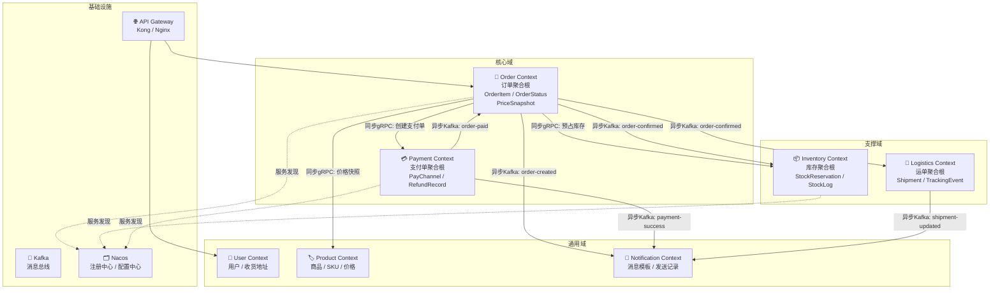

### 1.3 微服务拆分与职责边界

#### order-service（订单服务）— 核心服务

- **职责**：订单创建、状态机流转（待支付→已支付→已发货→已完成→已取消）、订单查询、退款申请
- **数据所有权**：`orders` 表、`order_items` 表、`order_status_logs` 表
- **对外接口**：HTTP REST（面向前端）+ gRPC（面向内部服务）
- **不负责**：支付处理、库存计算、物流跟踪

#### inventory-service（库存服务）

- **职责**：SKU 库存管理、预占（下单锁定）、实扣（支付成功）、释放（取消/超时）
- **数据所有权**：`inventory` 表、`stock_reservations` 表、`stock_logs` 表
- **对外接口**：gRPC（仅内部调用）
- **核心约束**：库存数据最终一致性 ≤ 3s，不允许超卖

#### payment-service（支付服务）

- **职责**：支付单创建、对接第三方支付（支付宝/微信）、支付回调处理、退款
- **数据所有权**：`payment_orders` 表、`refund_records` 表
- **对外接口**：HTTP（接收第三方回调）+ gRPC（内部查询）
- **核心约束**：支付回调必须幂等处理

#### logistics-service（物流服务）

- **职责**：创建运单、对接物流供应商、轨迹同步
- **数据所有权**：`shipments` 表、`tracking_events` 表
- **触发方式**：消费 `order-confirmed` Kafka 事件，异步创建运单

#### user-service（用户服务）

- **职责**：用户信息、JWT Token 鉴权、收货地址管理
- **数据所有权**：`users` 表、`addresses` 表
- **说明**：通用域服务，由 API Gateway 直接调用进行鉴权

#### notification-service（通知服务）

- **职责**：消费业务事件，发送短信/Push/邮件通知
- **数据所有权**：`notification_logs` 表
- **说明**：纯消费者，无对外 gRPC 接口，与业务服务完全解耦

### 1.4 服务依赖拓扑图

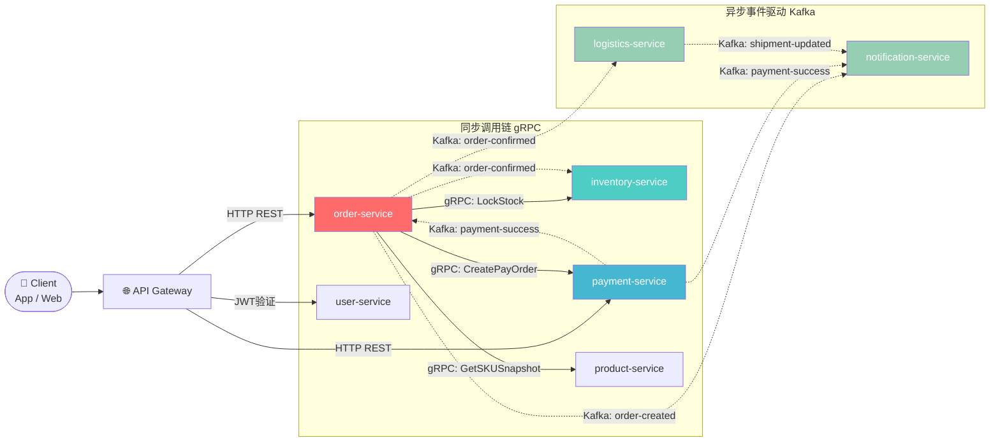

**循环依赖规避原则**：

- 所有同步调用方向单向流动：`order → inventory/payment/product`，下游服务不反向调用 order-service
- 跨域数据同步一律走 Kafka 异步事件，彻底解耦双向依赖
- payment-service 通过发布事件通知 order-service，而非直接 gRPC 回调

---

## 二、技术架构与组件选型

### 2.1 技术栈选型决策

#### Web 框架：选型 **Gin** ✅

| 维度 | Gin | Echo |
|------|-----|------|
| 性能 | ✅ httprouter，极低内存占用 | ✅ 相当，略逊 |
| 社区生态 | ✅ GitHub 77k+ Stars，生态最大 | 🟡 较成熟 |
| 中间件 | 🟡 需自行整合 | ✅ 内置更丰富 |
| 学习曲线 | ✅ 极平缓 | ✅ 平缓 |
| **适用场景** | **高并发 API 服务，团队规模大** | **快速原型，中间件重度依赖** |

**决策**：选 **Gin**。订单系统为高并发核心链路，Gin 的极简设计和 httprouter 路由树性能更可控；团队成员对 Gin 的熟悉程度普遍更高，降低协作摩擦。

#### ORM：选型 **GORM** ✅

| 维度 | GORM | Ent |
|------|------|-----|
| 代码生成 | ❌ 无 Schema 强约束 | ✅ Schema 即代码，类型安全 |
| 灵活性 | ✅ Raw SQL 随意穿插 | 🟡 复杂查询需适配 |
| 复杂查询 | ✅ 链式调用灵活 | 🟡 图遍历场景更佳 |
| 学习成本 | ✅ 低 | 🟡 中等 |
| **适用场景** | **关系型复杂查询、已有团队经验** | **实体关系复杂、强类型约束** |

**决策**：选 **GORM**。订单系统核心表结构相对稳定，涉及大量复杂 JOIN 查询和分片场景，GORM 的 Raw SQL 能力更灵活；分库分表场景下，GORM + ShardingSphere-Proxy 的组合更成熟。

#### 服务注册/配置中心：选型 **Nacos** ✅（题目约束已指定）

**补充说明 Trade-off**：

| 维度 | Nacos | Consul |
|------|-------|--------|
| 配置中心 | ✅ 原生支持，动态配置 | ❌ 需搭配 Vault |
| 服务发现 | ✅ AP/CP 可切换 | ✅ CP 强一致 |
| 健康检查 | ✅ 心跳/HTTP/TCP | ✅ 更丰富 |
| 生态 | ✅ 阿里系，与 Go SDK 配合好 | ✅ HashiCorp 生态 |

Nacos 在国内中间件生态（Sentinel、Dubbo）整合更顺畅，且统一提供配置中心能力，减少组件数量，符合当前技术栈约束。

#### 链路追踪：选型 **Jaeger + OpenTelemetry SDK** ✅

| 维度 | Jaeger | SkyWalking |
|------|--------|------------|
| Go 支持 | ✅ 原生 OTel SDK | 🟡 Java 优先，Go agent 较弱 |
| 数据存储 | Elasticsearch / Cassandra | ES / MySQL / TiDB |
| UI 能力 | ✅ 简洁实用 | ✅ 更丰富，拓扑图好用 |
| 协议 | OTLP 标准 | 私有协议为主 |

**决策**：选 **Jaeger**，通过 **OpenTelemetry SDK** 埋点（标准化，未来可无缝切换后端）。Go 生态对 OTel 的支持远优于 SkyWalking agent 方式。

#### 完整技术栈清单

```
Web 框架:       Gin 1.9+
gRPC:           google.golang.org/grpc
ORM:            GORM v2 + gen（代码生成）
数据库迁移:      golang-migrate/migrate
配置管理:       Nacos SDK + viper（本地降级）
日志:           uber-go/zap（结构化）
链路追踪:       OpenTelemetry Go SDK + Jaeger
熔断限流:       alibaba/sentinel-golang
消息队列:       IBM/sarama（Kafka）
缓存:           redis/go-redis/v9
本地缓存:       dgraph-io/ristretto（高性能本地缓存）
依赖注入:       google/wire（编译期注入）
错误处理:       pkg/errors（堆栈追踪）
参数校验:       go-playground/validator/v10
Mock 测试:      golang/mock + testify
```

### 2.2 标准项目目录结构

以 `order-service` 为例，所有微服务遵循统一目录规范：

```
order-service/
├── api/                        # 接口定义层（对外契约）
│   ├── proto/                  # .proto 文件（gRPC 接口定义）
│   │   └── order/v1/
│   │       └── order.proto
│   └── http/                   # OpenAPI / Swagger 定义
│       └── swagger.yaml
│
├── cmd/                        # 程序入口（每个可执行文件一个子目录）
│   └── server/
│       └── main.go             # 仅做依赖装配，禁止写业务逻辑
│
├── configs/                    # 配置文件模板（非敏感信息）
│   ├── config.yaml             # 本地开发配置
│   └── config.prod.yaml        # 生产环境配置模板（敏感值从 Nacos 注入）
│
├── internal/                   # 私有业务逻辑（禁止外部包导入）
│   ├── domain/                 # 领域层：聚合根、实体、值对象、领域事件
│   │   ├── order/
│   │   │   ├── aggregate.go    # Order 聚合根
│   │   │   ├── entity.go       # OrderItem 等实体
│   │   │   ├── value_object.go # Money、Address 值对象
│   │   │   ├── event.go        # OrderCreated、OrderPaid 领域事件
│   │   │   └── repository.go   # Repository 接口定义（依赖倒置）
│   │   └── ...
│   │
│   ├── application/            # 应用层：用例编排（Use Case），不含领域逻辑
│   │   ├── command/            # 写命令（CreateOrder、CancelOrder）
│   │   │   └── create_order.go
│   │   └── query/              # 读查询（GetOrderDetail、ListOrders）
│   │       └── get_order.go
│   │
│   ├── infrastructure/         # 基础设施层：技术实现细节
│   │   ├── persistence/        # 数据库实现（GORM）
│   │   │   ├── model/          # GORM 数据模型（PO）
│   │   │   ├── repository/     # Repository 接口实现
│   │   │   └── migration/      # SQL 迁移文件
│   │   ├── cache/              # Redis 缓存实现
│   │   ├── mq/                 # Kafka Producer / Consumer
│   │   └── rpc/                # gRPC Client（调用其他服务）
│   │       ├── inventory/
│   │       └── payment/
│   │
│   └── interfaces/             # 接口适配层（Adapter）
│       ├── http/               # HTTP Handler（Gin Router）
│       │   ├── handler/
│       │   ├── middleware/
│       │   └── dto/            # HTTP 请求/响应 DTO
│       └── grpc/               # gRPC Server Handler
│           └── handler/
│
├── pkg/                        # 可复用的公共库（允许其他服务导入）
│   ├── errors/                 # 业务错误码定义
│   ├── idgen/                  # 分布式 ID 生成（Snowflake）
│   ├── pagination/             # 分页工具
│   └── timeutil/               # 时间处理工具
│
├── scripts/                    # 构建、部署、数据库脚本
│   ├── build.sh
│   └── migrate.sh
│
├── deployments/                # K8s / Docker 部署配置
│   ├── Dockerfile
│   ├── docker-compose.yaml     # 本地联调
│   └── k8s/
│       ├── deployment.yaml
│       ├── service.yaml
│       └── configmap.yaml
│
├── test/                       # 集成测试 / E2E 测试
│   └── integration/
│
├── go.mod
├── go.sum
└── Makefile                    # 统一构建命令
```

**目录职责说明**：

- `internal/`：Go 语言原生访问控制，强制隔离。`domain` 层零依赖任何框架，`application` 层依赖 `domain` 接口而非实现，确保可测试性。
- `pkg/`：跨服务共享工具包，通过 Go Module 方式共享，避免将业务逻辑放入此目录。
- `api/`：接口契约优先（API First），`proto` 文件是 gRPC 服务的唯一真相来源，需纳入版本控制。

### 2.3 服务内部分层架构

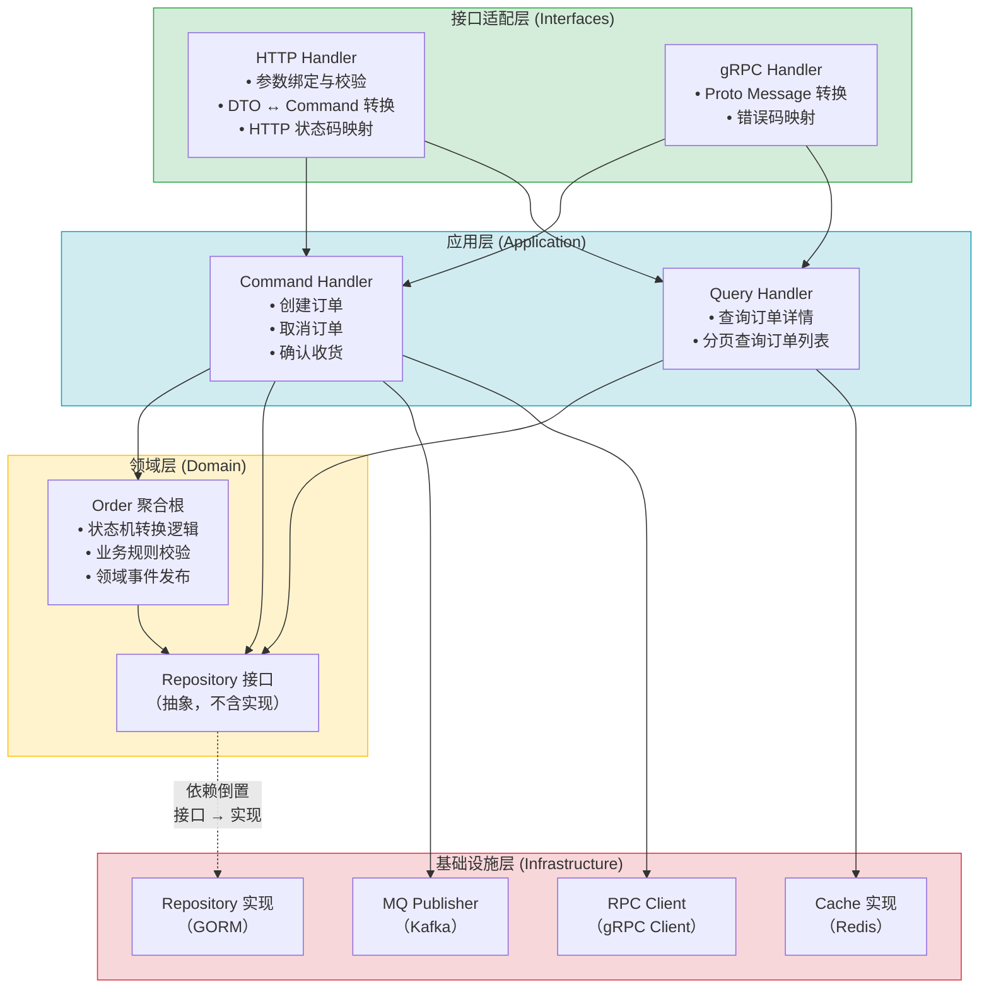

**分层约束**：

- 依赖方向严格向下：`interfaces → application → domain ← infrastructure`
- `domain` 层不得导入任何框架包（Gin/GORM/Redis），保证纯粹性与可测试性
- `application` 层通过接口依赖 `domain.Repository`，具体实现由 `wire` 在启动时注入

---

## 三、核心业务流程设计

### 3.1 下单完整时序图

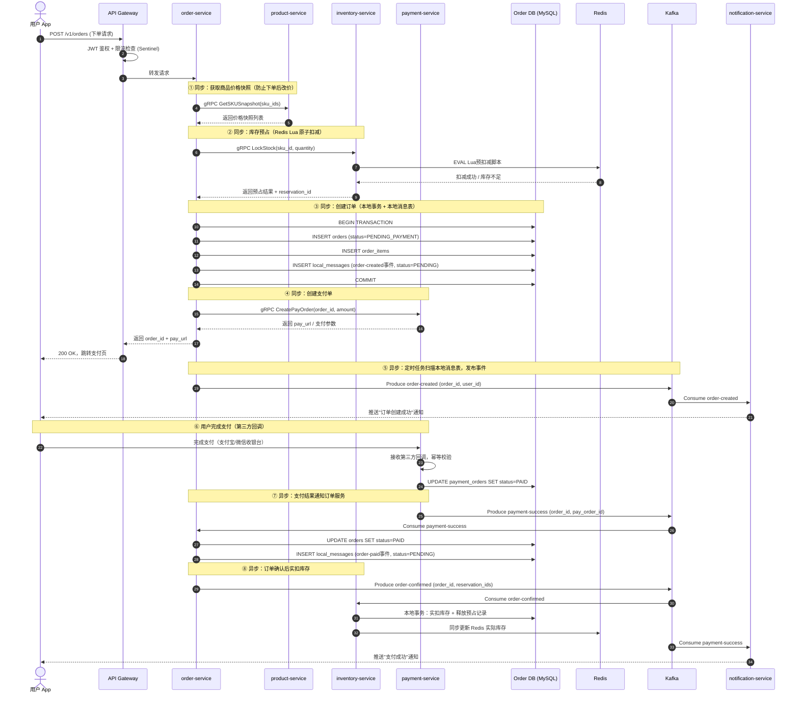

### 3.2 分布式事务方案

#### 方案对比：Seata AT 模式 vs Saga 模式

| 维度 | Seata AT 模式 | Saga 模式 |
|------|--------------|-----------|
| 一致性保证 | 强一致（阶段提交） | 最终一致 |
| 侵入性 | 低（代理数据源） | 中（需实现补偿逻辑） |
| 性能 | 🟡 有锁，并发受限 | ✅ 无全局锁 |
| 适用场景 | 短事务、简单场景 | 长事务、高并发 |
| 回滚复杂度 | ✅ 自动回滚 | ❌ 需手动编写补偿 |
| 日均百万量级 | ❌ 全局锁影响吞吐量 | ✅ 推荐 |

**决策**：订单场景选择 **Saga 模式 + 本地消息表**实现最终一致性。

原因：下单流程涉及 order-service、inventory-service、payment-service 三方，事务跨度长（含第三方支付回调，可能延迟数秒），Seata AT 的全局锁在百万级并发下会成为瓶颈。

#### 本地消息表 + 定时补偿方案

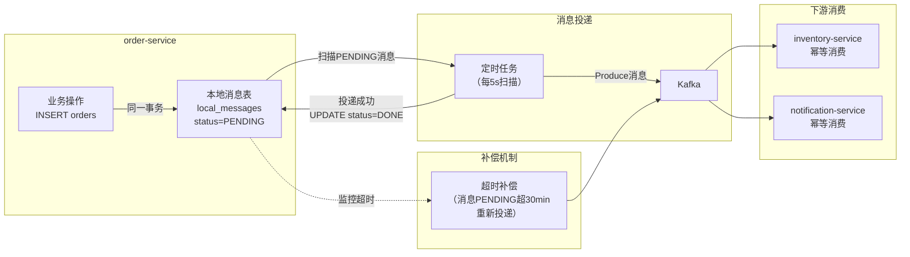

**幂等性保障**：每条消息携带全局唯一 `message_id`（Snowflake），消费者在处理前先查 Redis 是否已消费，已消费则直接返回 ACK，保证"至少一次投递 + 幂等消费 = 恰好一次效果"。

#### 超时订单自动取消

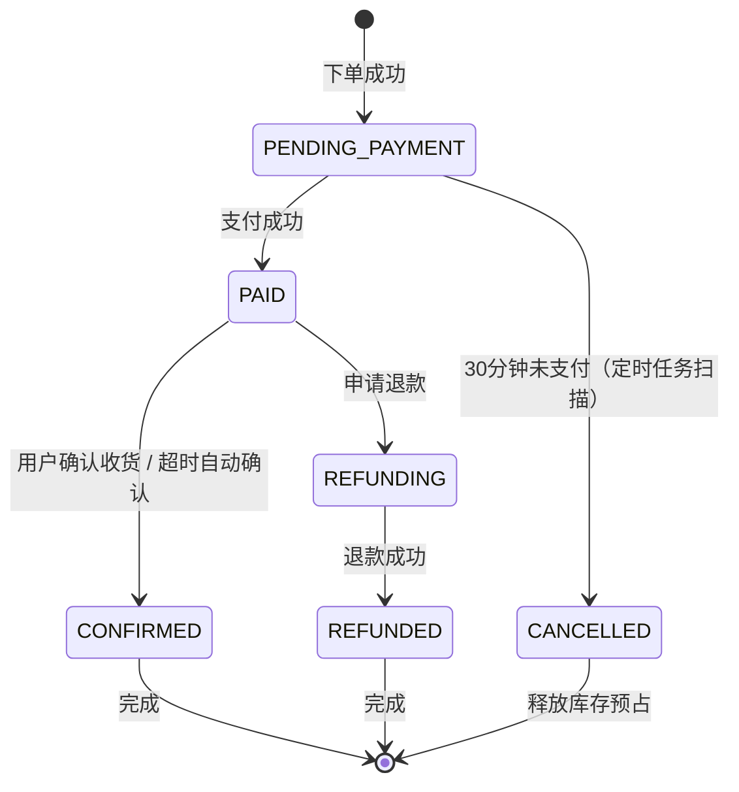

### 3.3 库存扣减策略：防超卖机制

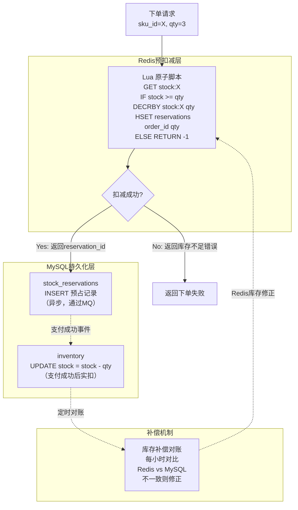

**防超卖三重保障**：

1. **Redis Lua 原子扣减**：利用 Redis 单线程特性，Lua 脚本保证"查询+扣减"原子性，防并发超卖
2. **MySQL 乐观锁兜底**：实扣时 `UPDATE inventory SET stock = stock - qty WHERE sku_id = X AND stock >= qty`，失败则触发告警
3. **定时对账**：每小时对比 Redis 与 MySQL 库存数量，差异超过阈值触发告警并修正

---

## 四、基础设施与高可用设计

### 4.1 数据库设计策略

#### 分库分表方案

| 服务 | 分片键 | 分片规则 | 分库数 | 分表数 |
|------|-------|---------|-------|-------|
| order-service | `user_id` | 哈希取模 | 4库 | 64表（每库16表） |
| inventory-service | `sku_id` | 哈希取模 | 2库 | 16表 |
| payment-service | `order_id` | 哈希取模 | 2库 | 16表 |

**选择 `user_id` 作为订单分片键的理由**：
- 80% 的查询场景为"查询我的订单"，按 user_id 分片可保证同一用户订单落在同一分片，避免跨片查询
- 订单号（`order_no`）查询通过路由表或 `order_no` 中编码 `user_id` 后4位来定位分片

**实现工具**：ShardingSphere-Proxy 5.x（透明代理模式，应用无感知）

#### 核心表索引设计

```sql
-- orders 表核心索引设计
CREATE TABLE orders_00 (          -- 按 user_id % 64 路由
    id            BIGINT PRIMARY KEY,         -- Snowflake ID
    order_no      VARCHAR(32) NOT NULL,       -- 业务订单号（编码分片信息）
    user_id       BIGINT NOT NULL,
    status        TINYINT NOT NULL,           -- 枚举：1待付款/2已付款/...
    total_amount  DECIMAL(12,2) NOT NULL,
    created_at    DATETIME(3) NOT NULL,
    updated_at    DATETIME(3) NOT NULL,
    deleted_at    DATETIME(3),                -- 软删除

    -- 索引策略
    UNIQUE KEY uk_order_no (order_no),                        -- 全局唯一，防重复下单
    KEY idx_user_status (user_id, status, created_at),       -- 覆盖索引：用户订单列表
    KEY idx_created_at (created_at)                          -- 范围查询：数据归档
) ENGINE=InnoDB;
```

#### 读写分离

- 架构：1主2从（MySQL Group Replication，半同步复制）
- 路由：GORM 配置 `dbresolver` 插件，写操作（INSERT/UPDATE/DELETE）走主库，读操作走从库
- 延迟容忍：复制延迟 ≤ 100ms；订单详情查询对强一致性有要求时（如支付后立即查询），强制走主库

#### 数据库迁移策略

- 工具：`golang-migrate/migrate`，SQL 文件纳入 Git 版本控制
- 规范：每次变更新增迁移文件（`V{version}__{description}.up.sql` / `.down.sql`），禁止修改历史文件
- 执行：CI/CD 流水线在部署前自动执行 `migrate up`，失败则阻断发布

### 4.2 缓存策略

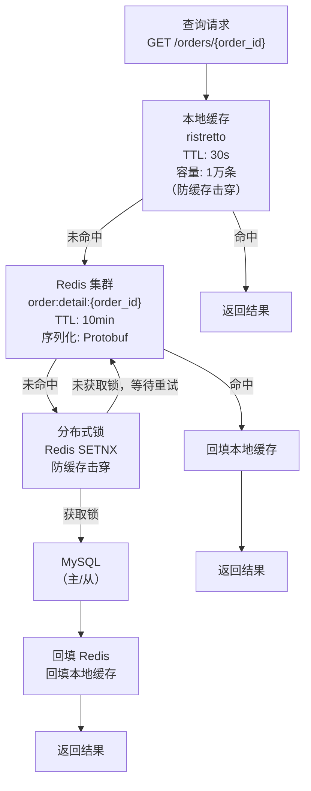

#### 缓存一致性方案

采用 **Cache-Aside + 延迟双删** 策略：

1. **写操作**：先更新 MySQL → 删除 Redis 缓存（非更新，防止并发写导致旧值覆盖）
2. **延迟二次删除**：主库写入后，延迟 500ms 再次删除 Redis 缓存（应对主从复制延迟期间从库读到旧数据的场景）
3. **TTL 兜底**：所有缓存设置 TTL（10min），即使二次删除失败，最终也会过期

#### Redis 数据结构选型

| 场景 | Key 设计 | 数据结构 | TTL |
|------|---------|---------|-----|
| 订单详情缓存 | `order:detail:{order_id}` | String（Protobuf序列化） | 10min |
| 库存预占计数 | `stock:{sku_id}` | String（整数） | 永久（业务控制） |
| 库存预占明细 | `reservations:{sku_id}` | Hash（order_id → qty） | 1h |
| 幂等去重 | `idempotent:{message_id}` | String | 24h |
| 用户购物车 | `cart:{user_id}` | Hash（sku_id → qty） | 7天 |
| 限流计数器 | `ratelimit:{user_id}:{window}` | String（incr） | 60s |

### 4.3 Kafka Topic 设计

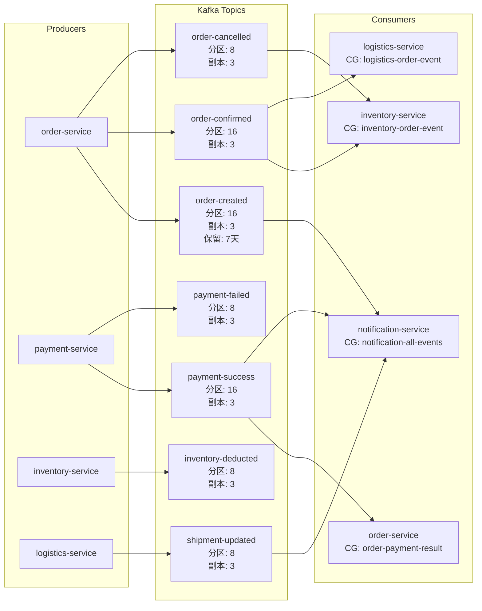

**Topic 设计原则**：

- 分区数按峰值 TPS / 单消费者处理能力估算：订单峰值 TPS ≈ 5000，单 Consumer 处理 500/s，故 `order-created` 设 16 分区
- 分区键（Partition Key）：使用 `order_id` 作为分区键，保证同一订单的事件有序
- 消费者组隔离：不同业务消费者使用独立的 Consumer Group，互不影响进度
- 死信队列（DLQ）：消费失败超过 3 次后，消息转入 `{topic}.DLQ`，人工介入处理

### 4.4 API 网关策略

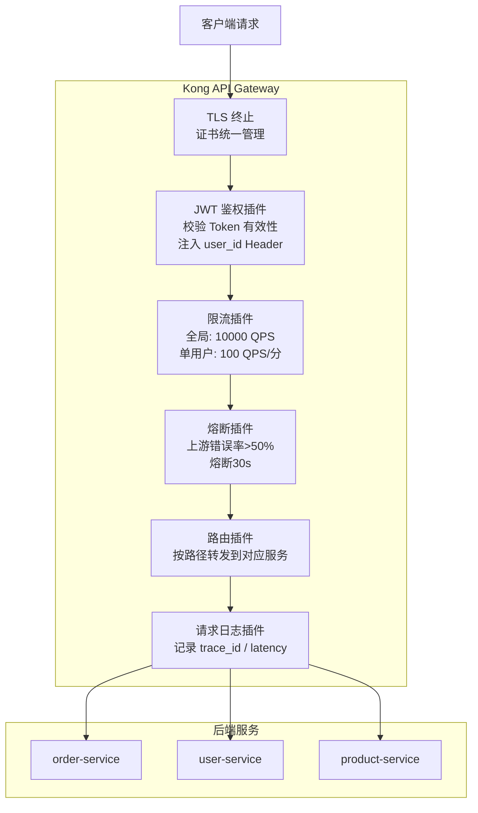

### 4.5 容错机制设计

#### Sentinel 熔断降级规则

| 接口 | 规则类型 | 阈值 | 降级策略 |
|------|---------|------|---------|
| 下单接口 | QPS 限流 | 5000 QPS | 排队等待 → 拒绝并返回"系统繁忙" |
| 库存预占（gRPC） | 慢调用比例 | RT>200ms 比例>50% | 熔断30s，返回"库存查询失败"，触发告警 |
| 商品快照（gRPC） | 异常数 | 10次/20s | 熔断，使用缓存商品信息降级 |
| 支付创建（gRPC） | 异常比例 | >30% | 熔断，返回"支付服务暂时不可用" |

#### gRPC 重试策略

- **幂等接口**（查询类）：自动重试 3 次，初始间隔 100ms，指数退避，最大间隔 1s
- **非幂等接口**（下单、扣库存）：禁止自动重试，上层通过幂等 Key 处理重复请求
- **超时配置**：gRPC Deadline 传递，下单总链路超时 3s，单个 RPC 调用超时 500ms

---

## 五、可观测性与运维

### 5.1 结构化日志规范

#### 日志格式（JSON）

```json
{
  "timestamp": "2024-01-15T10:30:00.123Z",
  "level": "INFO",
  "service": "order-service",
  "version": "v1.2.3",
  "env": "production",

  "trace_id": "4bf92f3577b34da6a3ce929d0e0e4736",
  "span_id": "00f067aa0ba902b7",

  "user_id": 10086,
  "order_id": "1234567890123456789",
  "order_no": "ORD202401151030001234",

  "msg": "订单创建成功",
  "duration_ms": 45,

  "caller": "internal/application/command/create_order.go:87",
  "method": "POST /v1/orders",
  "status_code": 200
}
```

#### 日志级别规范

| 级别 | 使用场景 | 示例 |
|------|---------|------|
| **ERROR** | 影响业务的错误，需立即告警 | 数据库连接失败、支付回调处理异常 |
| **WARN** | 潜在问题，需关注 | 库存不足（业务正常）、缓存击穿 |
| **INFO** | 关键业务节点 | 订单创建、状态流转、支付成功 |
| **DEBUG** | 调试信息（生产禁用） | SQL 详情、RPC 请求体 |

#### ELK 采集方案

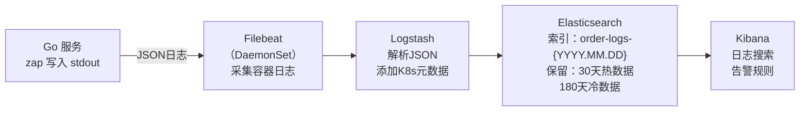

### 5.2 监控指标体系

#### Prometheus 核心指标

```
# 业务指标（RED方法：Rate / Errors / Duration）
order_create_total{status="success|failed"}          # 订单创建总数
order_create_duration_seconds{quantile="0.99"}       # 下单 P99 耗时
inventory_deduct_duration_seconds{quantile="0.95"}  # 库存扣减 P95 耗时
payment_callback_total{channel="alipay|wechat"}      # 支付回调次数
payment_callback_duration_seconds                    # 支付回调处理耗时

# 系统指标（USE方法：Utilization / Saturation / Errors）
go_goroutines                                        # Goroutine 数量
go_gc_duration_seconds                               # GC 暂停时间
process_cpu_seconds_total                            # CPU 使用率
process_resident_memory_bytes                        # 内存占用

# 依赖健康指标
db_connection_pool_idle                              # 数据库连接池空闲数
redis_connected_slaves                               # Redis 从节点数
kafka_consumer_group_lag                             # 消费者积压量
```

#### Grafana 看板设计

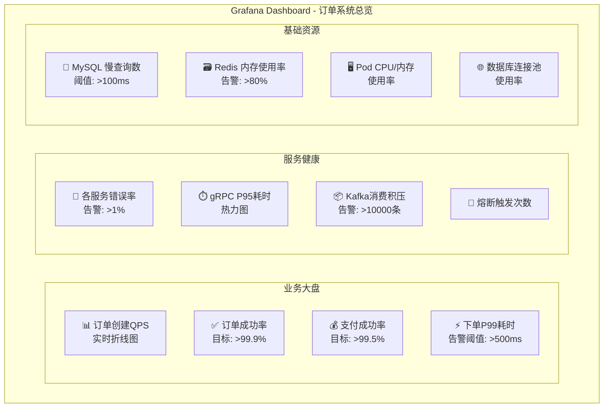

#### 告警规则（PagerDuty / 钉钉）

| 告警名称 | 条件 | 级别 | 响应时间 |
|---------|------|------|---------|
| 订单创建成功率下降 | 成功率 < 99% 持续2分钟 | P0 紧急 | 5分钟 |
| 下单P99耗时超标 | P99 > 1s 持续3分钟 | P1 严重 | 15分钟 |
| Kafka 消费积压 | 积压 > 50000条 持续5分钟 | P1 严重 | 15分钟 |
| 数据库连接耗尽 | 连接池使用率 > 90% | P1 严重 | 15分钟 |
| 库存扣减失败率 | 失败率 > 5% 持续1分钟 | P0 紧急 | 5分钟 |
| Redis内存告警 | 使用率 > 85% | P2 警告 | 60分钟 |

### 5.3 分布式链路追踪

#### OpenTelemetry 埋点方案

```mermaid
flowchart LR
    subgraph 埋点层（自动 + 手动）
        GIN["Gin HTTP 中间件<br/>（自动埋点）<br/>生成 Root Span"]
        GRPC["gRPC 拦截器<br/>（自动埋点）<br/>传播 TraceContext"]
        GORM_P["GORM Plugin<br/>（自动埋点）<br/>记录 SQL 语句"]
        KAFKA_P["Kafka Producer/Consumer<br/>（手动埋点）<br/>Header传播TraceID"]
        CUSTOM["业务关键节点<br/>（手动埋点）<br/>订单状态流转、库存扣减"]
    end

    subgraph 数据上报
        OC["OTel Collector<br/>（DaemonSet）<br/>采样率: 100%（错误）<br/>          1%（成功）"]
    end

    subgraph 存储与可视化
        JG["Jaeger<br/>Elasticsearch 后端<br/>数据保留: 7天"]
    end

    GIN --> OC
    GRPC --> OC
    GORM_P --> OC
    KAFKA_P --> OC
    CUSTOM --> OC
    OC --> JG
```

#### 关键链路追踪示例（下单→支付→发货）

```
TraceID: 4bf92f3577b34da6a3ce929d0e0e4736
│
├─ [HTTP] POST /v1/orders                              0ms ~ 210ms (Root Span)
│   ├─ [gRPC] product-service.GetSKUSnapshot           2ms ~ 15ms
│   ├─ [gRPC] inventory-service.LockStock              16ms ~ 45ms
│   │   └─ [Redis] EVAL lua_stock_deduct               1ms ~ 3ms
│   ├─ [DB] INSERT orders (order_shard_03)             46ms ~ 80ms
│   ├─ [DB] INSERT local_messages                      81ms ~ 90ms
│   └─ [gRPC] payment-service.CreatePayOrder           91ms ~ 200ms
│
├─ [Kafka] Consume: payment-success                    T+3s（支付完成）
│   ├─ [DB] UPDATE orders SET status=PAID
│   └─ [Kafka] Produce: order-confirmed
│
└─ [Kafka] Consume: order-confirmed (logistics)        T+3.5s
    ├─ [HTTP] 调用物流供应商API创建运单
    └─ [DB] INSERT shipments
```

**Span 标签（Tags）规范**：

每个 Span 必须携带以下业务标签，便于问题定位：

```
order.id       = "1234567890123456789"
order.no       = "ORD202401151030001234"
user.id        = "10086"
db.shard       = "order_shard_03"
mq.topic       = "payment-success"
mq.partition   = "5"
mq.offset      = "1234567"
```

---

## 附录：架构全景图

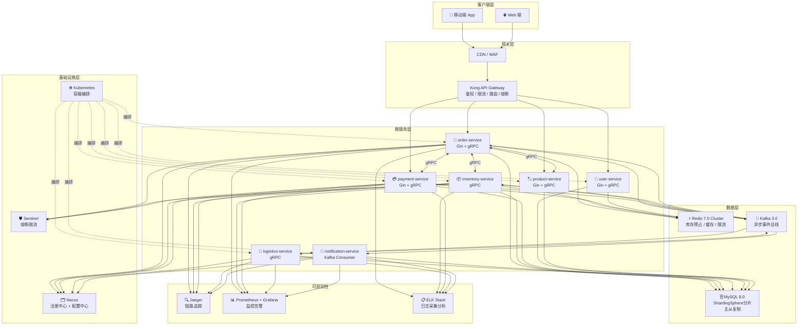

---

*文档版本：v1.0 | 最后更新：2024-01 | 维护人：架构组*
